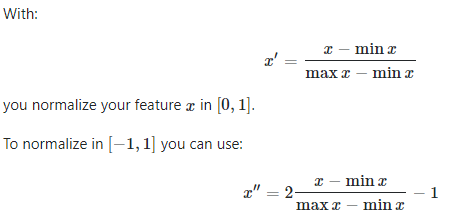
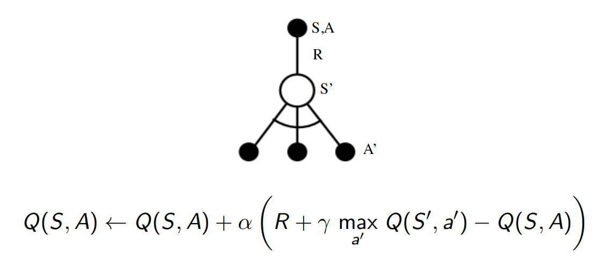
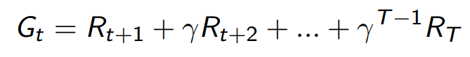
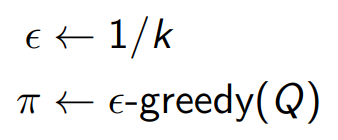
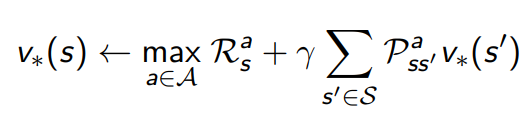
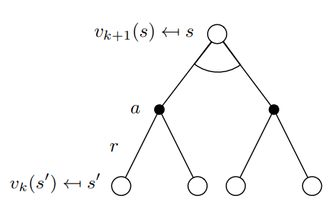
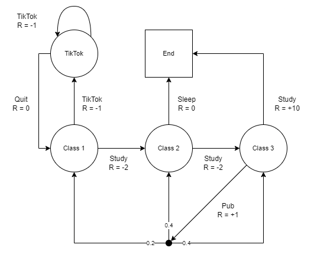
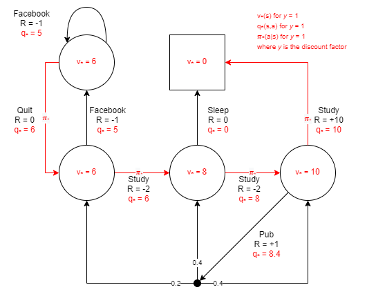

# Reinforcement Learning Notes

My notes for learning RL.

## Test

```
python -m unittest
```

## Algorithms

### Monte-Carlo Policy Gradient (REINFORCE) Control

_TODO_

```
pipenv run python src/main.py -e 500 -m racecar-mdp monte-carlo-policy-gradient --layers 2,16
```

#### Normalization

Added state normalization in the range [-1,1] when using `RacecarBulletGymMDP` because during training the policy approximation function would return NaN action probabilities. Normalization helped but sometimes it will still fail before `max_episodes` is complete. 

Some things to look into to investigate further:

1. Try smoothing the rewards from the gym environment, it seems to start low (i.e. < -150). 
2. Try using a policy approximation function with batch norm layers.



### Q-Learning Off-Policy Control

Implementing the Q-Learning off-policy algorithm (aka SARSAMAX). Given a state-action pair, the algorithm updates the action-value function for that state-action pair towards the optimal action-value function. The behaviour policy (i.e. the policy that dictates what actions we will take) is an epsilon-greedy policy. The epsilon value is controlled using the `epsilon` parameter. The target policy (i.e. the policy we are evaluating) is a greedy policy. The target policy is implemented by getting the max action-value function across all state-action pairs, where the state-action pairs are the state we end up in and all possible actions from that state (i.e. S' and a').  The rate at which the action-value function is updated across the episodes is control by the parameter `change-rate`. The max action-value function is discounted using the `discount-rate` parameter.



#### Run Q-Learning Off-Policy Control

```
python ./src/main.py q-learning
```

#### Test Q-Learning Off-Policy Control

```
python -m unittest tests.algorithm.test_q_learning.TestQLearning.test_algorithm
```

#### Q-Learning Off-Policy Control References

1. Chapter 6.5 in [reference #1](#references).
2. Lecture 5 in [reference #2](#references) at [1:19:50](https://youtu.be/0g4j2k_Ggc4?t=4790).

### GLIE Monte-Carlo Control

Implementing the GLIE (Greedy in the Limit with Infinite Exploration) Monte-Carlo control algorithm on the [student MDP example](#student-mdp). GLIE refers to the policy converging to a greedy policy as the episodes increase. In this algorithm implementation we are using an epsilon-greedy policy, where epsilon is updated to 1 / the _k_ th episode.

Within each episode, every time a state-action pair is visited, the total discounted reward from that point onwards (or from that time step _t_ onwards) to the end of the episode is stored for each state-action pair.



That reward is then used to incrementally update the action-value function for all state-action pairs taken in that episode towards the mean of all the rewards seen for each state-action. To calculate the incremental mean, we keep track of the number of state-action visits across all episodes.


At the end of each episode, we update the policy so as to converge on the optimal policy. 
1. We update epilson to 1/k, where _k_ is the episode; and 
2. We update the state-action mapping to be the action with the max action-value for each state.



#### Run GLIE Monte-Carlo Control

```
python ./src/main.py monte-carlo
```

#### Test GLIE Monte-Carlo Control

```
python -m unittest tests.algorithm.test_monte_carlo.TestMonteCarlo.test_algorithm
```

**Note:** The resulting policy is deterministic (as the number of episodes goes to infinity) but the resulting action-value function is not, because of the stochastic nature of picking an action from a state combined with the policy converging to a greedy policy. This results in the values for each state-action pair to be farther from the true value as the state gets farther from the terminal state. For example, the state-action value of _State 3_ always equals the true state-action value, _State 2_ is typically (although not always) within +/-0.5 of the true state-action value, but _State 0_ is consistently outside +/-1 of the true state-action value. A couple ways to fix this (not yet explored) could be to converge to a greedy policy more slowly while increasing the number of total episodes.

#### GLIE Monte-Carlo Control References

1. Chapter 5.3 in [reference #1](#references).
2. Lecture 4 in [reference #2](#references) at [5:06](https://youtu.be/PnHCvfgC_ZA?t=306).
2. Lecture 5 in [reference #2](#references) at [25:37](https://youtu.be/0g4j2k_Ggc4?t=1537).

### Value Iteration

Implementing the value iteration algorithm on the [student MDP example](#student-mdp).





#### Run Value Iteration

```
python ./src/main.py value-iteration
```

#### Test Value Iteration

```
python -m unittest tests.algorithm.test_value_iteration.TestValueIteration.test_algorithm
```

#### Value Iteration References

1. Chapter 4.4 in [reference #1](#references).
2. Lecture 3 in [reference #2](#references) at [1:01:45](https://youtu.be/Nd1-UUMVfz4?t=3705).

## MDPs

### Drift Car MDP

An MDP that encapsultes a [gym-based](https://www.gymlibrary.dev/) environment. The custom gym, `DriftCarEnvV0`, is based on the [PyBullet RacecarBulletEnv-v0](https://docs.google.com/document/d/10sXEhzFRSnvFcl3XxNGhnD4N2SedqwdAvK3dsihxVUA/edit#heading=h.wz5to0x8kqmr), which itself is based on the [MIT Racecar](https://racecar.mit.edu/platform).

To install:

```
pipenv run pip install -e src/mdp/sem_gyms/
```

### Student MDP

An example MDP for testing algorithms based off of the example in Lecture 2 in [reference #2](#references) at [1:21:47](https://youtu.be/lfHX2hHRMVQ?t=4907).



#### Solved Student MDP

The optimal value function, action-value function and policy for this student MDP example. The algorithm test on this MDP should target these functions.



## References

1. [Reinforcement Learning: An Introduction](http://incompleteideas.net/book/RLbook2020.pdf)
2. [DeepMind x UCL | Introduction to Reinforcement Learning 2015](https://www.youtube.com/playlist?list=PLqYmG7hTraZDM-OYHWgPebj2MfCFzFObQ)

