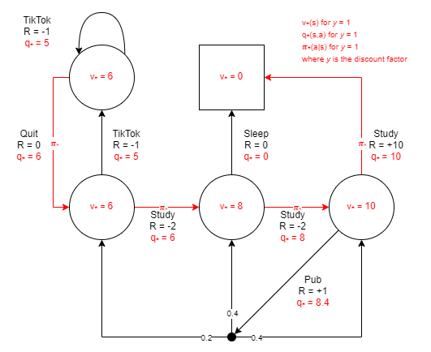

# Reinforcement Learning Notes

My notes for learning RL.

## Setup

```
python -m venv env

.\env\Scripts\activate

pip install -r requirements.txt
```

## Test

```
python -m unittest
```

## Algorithms

### Value Iteration

Implementing the value iteration algorithm on the student MDP example.

#### Test Value Iteration

```
python -m unittest tests.test_value_iteration.TestValueIteration.test_algorithm
```

#### Value Iteration References

1. Chapter 4.4 in [reference #1](#references).
2. Lecture 3 in [reference #2](#references) at [1:01:45](https://youtu.be/Nd1-UUMVfz4?t=3705).

## MDPs

### Student MDP

An example MDP for testing algorithms based off of the example in Lecture 2 in [reference #2](#references) at [1:21:47](https://youtu.be/lfHX2hHRMVQ?t=4907).


#### Solved Student MDP

The optimal value function, action-value function and policy for this student MDP example. The algorithm test on this MDP should target these functions.



## References

1. [Reinforcement Learning: An Introduction](http://incompleteideas.net/book/RLbook2020.pdf)
2. [DeepMind x UCL | Introduction to Reinforcement Learning 2015](https://www.youtube.com/playlist?list=PLqYmG7hTraZDM-OYHWgPebj2MfCFzFObQ)

