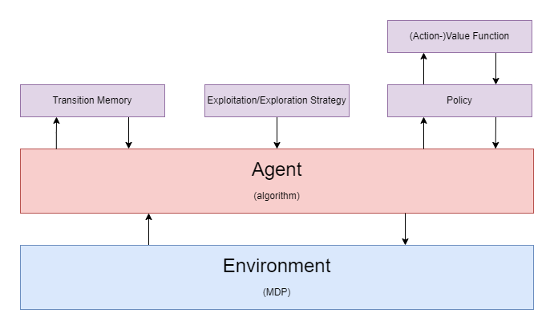

# Reinforcement Learning

## Introduction

Reinforcement learning is learning what to do (mapping situations to actions) so as to maximize a numerical reward signal. It is much more focused on goal-directed learning from interaction than other machine learning approaches.

* Supervised learning: learning from a training set of labeled examples.
* Unsupervised learning: Learning from finding hidden structures in unlabeled data.

Reinforcement learning is the closest of all the machine learning types to the way humans and other animals learn and many of the core algorithms were originally inspired by biological learning systems.

## Problem Formulation

The agent-environment interface is a way to formalize the reinforcement learning problem so as to create a way to solve it. The agent and environment continually interact over time.

* Agent: the learner and the decision maker that seeks to achieve a _goal_.
* Environment: the thing the agent interacts with, comprising everything outside the agent.
* Action: the thing the agent selects and then applies to the environment.
* State: a representation based on the selected action.
* Reward: a special numerical value that the agents seeks to maximize.

## Solution Formulation

* Policy: defines how the agent should behave at a given time. Essentially, it is a mapping of states to actions.
* Value function (Action-value function): defines what is good in the long run. Essentially, it is a mapping of states (or states and actions) to the value (i.e. the total amount of reward) the agent can expect to accumulate over the future.
* Episode: a way to break up agent-environment interactions into subsequences. Each episode has a _terminal state_ at which point the episode ends and a new one begins. It is analagous to time-loop movie like [See You Yesterday](https://www.imdb.com/title/tt8743064) or [Groundhog Day](https://www.imdb.com/title/tt0107048/) where each day is an episode.
* Transition memory: a historical record of each transition (the resulting state and reward from the agent's selection action) over the course of multiple episodes.
* Exploration/Exploitation Strategy: defines the balance the agent takes between picking optimal actions based on what has worked in the past (exploitation) and discovering potential actions that may work more optimal than it is currently aware of (exploration).
* Markov Decision Process (MDP): a way to model the sequential decision making process, which can be thought of as mathematical equation that the agent needs to solve.
* Algorithm: determines _how_ the agent will learn how to solve the MDP (e.g. Monte-Carlo, DQN, Actor-Critic).

TODO: define these things

* bellman equation

## References

* Richard S. Sutton and Andrew G. Barto. Reinforcement Learning: An Introduction. The MIT Press, 2018.
* DeepMind x UCL | Introduction to Reinforcement Learning 2015. https://www.youtube.com/playlist?list=PLqYmG7hTraZDM-OYHWgPebj2MfCFzFObQ
