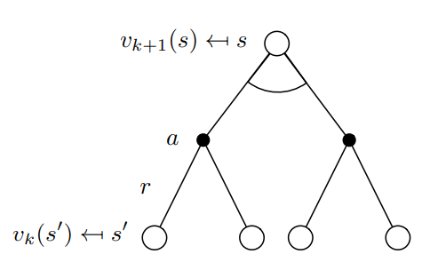
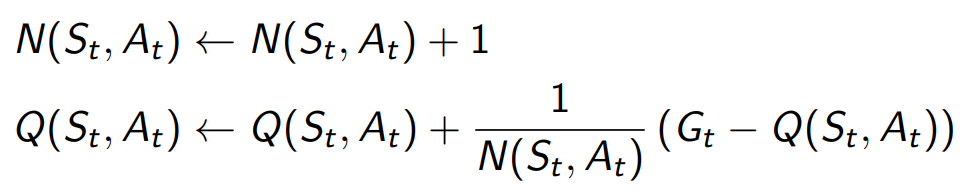

# Reinforcement Learning

## Introduction

Reinforcement learning is learning what to do (mapping situations to actions) so as to maximize a numerical reward signal. It is much more focused on goal-directed learning from interaction than other machine learning approaches.


* Supervised learning: learning from a training set of labeled examples.
* Unsupervised learning: Learning from finding hidden structures in unlabeled data.

### Why Reinforcement Learning?

Reinforcement learning is a fully-realized implementation of all components of STEM (i.e. science, technology, engineering, and mathematics). The enthusiasm for reinforcement learning is best depicted from the excerpt below [1].

```
One of the most exciting aspects of modern reinforcement learning is its substantive
and fruitful interactions with other engineering and scientific disciplines. Reinforcement
learning is part of a decades-long trend within artificial intelligence and machine learning
toward greater integration with statistics, optimization, and other mathematical subjects.
For example, the ability of some reinforcement learning methods to learn with parameterized approximators addresses the classical “curse of dimensionality” in operations research
and control theory. More distinctively, reinforcement learning has also interacted strongly
with psychology and neuroscience, with substantial benefits going both ways. Of all the
forms of machine learning, reinforcement learning is the closest to the kind of learning
that humans and other animals do, and many of the core algorithms of reinforcement
learning were originally inspired by biological learning systems. Reinforcement learning
has also given back, both through a psychological model of animal learning that better
matches some of the empirical data, and through an influential model of parts of the
brain’s reward system.
```

## Problem Formulation

The agent-environment interface is a way to formalize the reinforcement learning problem so as to create a way to solve it. The agent and environment continually interact over time.


* Agent: the learner and the decision maker that seeks to achieve a _goal_.
* Environment: the thing the agent interacts with, comprising everything outside the agent.
* Action: the thing the agent selects and then applies to the environment.
* State: a representation based on the selected action.
* Reward: a special numerical value that the agents seeks to maximize.

## Solution Formulation

Building a solution to the reinforcement learning problem requires an understanding of the components required to teach the agent to achieve its goal.


* Policy: defines how the agent should behave at a given time. Essentially, it is a mapping of states to actions.
* Value function (Action-value function): defines what is good in the long run. Essentially, it is a mapping of states (or states and actions) to the value (i.e. the total amount of reward) the agent can expect to accumulate over the future.
* Episode: a way to break up agent-environment interactions into subsequences. Each episode has a _terminal state_ at which point the episode ends and a new one begins. It is analagous to time-loop movie like [See You Yesterday](https://www.imdb.com/title/tt8743064) or [Groundhog Day](https://www.imdb.com/title/tt0107048/) where each day is an episode.
* Transition memory: a historical record of each transition (the resulting state and reward from the agent's selection action) over the course of multiple episodes.
* Exploration/Exploitation Strategy: defines the balance the agent takes between picking optimal actions based on what has worked in the past (exploitation) and discovering potential actions that may work more optimal than it is currently aware of (exploration).
* Markov Decision Process (MDP): a way to model the sequential decision making process, which can be thought of as mathematical equation that the agent needs to solve.
* Algorithm: determines _how_ the agent will learn how to solve the MDP (e.g. Monte-Carlo, DQN, Actor-Critic).

## Grid Target Environment

An environment where the goal is for the agent (robot icon) to reach the target (beach icon).

* State space: grid width * grid height (default: 5x5)
* Action space: north, east, south, west
* Reward function: 1 if agent is on target, otherwise -1


## Algorithms: Basic

There are a number of algorithms that the agent can apply to solve the MDP, each with their own trade-offs (e.g. time to learn, robustness of learning).

### Bellman Equation

The Bellman equation is at the heart of reinforcement learning solutions. It is a dynmaic programming method defined as the value of all state-action pairs being the immediate reward plus the discounted sum of all future rewards.


In reinforcement learning, we solve the MDP by finding the function (i.e. Q*) that gives us the correct value for each state-action pair. We calculate the values by using the _returns_ at every time-step.


It helps to conceptualize the value calculation by considering the backup diagram for a state-action transition. At every state we can take an action, which will lead us to some other state. We are trying to calculate which action will lead us to the state with the most value.




* G<sub>t</sub>: the return, which is the total discounted reward from time-step _t_.
* V<sub>𝜋</sub>: the value function defining the expected return at state _s_ when following policy 𝜋.
* Q<sub>𝜋</sub>: the action-value function defining the expected return at state _s_ and taking action _a_ when following policy 𝜋.
* V<sub>*</sub>: the optimal value function defining the expected return at state _s_.
* Q<sub>*</sub>: the optimal action-value function defining the expected return at state _s_ and taking action _a_.

### Monte-Carlo

The Monte-Carlo algorithm updates the action-value function for every visited state-action pair at the end of every episode. It updates the function by calculating the incremental mean of the returns across all episodes for every visited state-action pair.



Within each episode, every time a state-action pair is visited, the total discounted reward from that time-step _t_ to the end of the episode is tracked.


#### Train

```
pipenv run python src/game.py grid-target monte-carlo --discount-rate .8
```

#### Run

```
pipenv run python src/game.py --run-id <run-id> grid-target --display --trail monte-carlo
```

### Q-Learning

The Q-Learning algorithm is a type of Temporal-Difference learning algorithm. It updates the action-value function for each state-action pair after every time step. The algorithm uses to policies (known as an off-policy algorithm). There is a behaviour policy which dictates what actions the agent will take and a target policy which is used to update the action-value function. The behaviour policy picks actions using an exploration/exploitation strategy. The target policy picks the action from a state with the maximum value.


#### Train

```
pipenv run python src/game.py grid-target q-learning --discount-rate .7 --change-rate .2
```

#### Run

```
pipenv run python src/game.py --run-id <run-id> grid-target --display --trail q-learning
```

### Monte-Carlo vs. Q-Learning (Temporal-Difference)

The difference between a Monte-Carlo (MC) algorithm and a Temporal-Difference (TD) algorithm has to do with a bias-variance trade-off. A TD algorithm is an algorithm that learns _online_, meaning that it learns during the episode as it traverses throught environment. The process of learning from incomplete episodes is known as _bootstrapping_. The algorithm uses an estimated value to update an estimated value.

Both MC and TD algorithms can be generalized to:

* Q<sub>𝜋</sub>(s,a) ← Q<sub>𝜋</sub>(s,a) + α(target - Q<sub>𝜋</sub>(s,a)), where target equals:
  * G<sub>t</sub> for an MC algorithm
  * R + γQ<sub>𝜋</sub>(s,a) for a TD algorithm

An MC algorithm has high variance and zero bias, whereas a TD algorithm as low variance but some bias. In the context of general maching learning, high bias is the process as underfitting and high variance is the process of overfitting.

#### Bias

In the context of RL, bias is defined as the difference between the estimated value and the true value, E[target] - Q<sub>𝜋</sub>(s,a). Because the action-value function is defined as Q<sub>𝜋</sub>(s,a) = E[G<sub>t</sub>] an MC algorithm uses G<sub>t</sub>, it uses an unbiased estimate of the action-value function. However, a TD algorithm uses Q<sub>𝜋</sub>(s,a) in its calculation of the target, which is an estimate itself. Therefore, the TD target is biased.

A TD algorithm only considers the immediate reward so it does not generalize well to experiences it hasn't seen. In other words, it underfits the episode. TD algorithms are usually more efficient that MC algorithms but don't converge as well and are more sensitive to initial values.

#### Variance

In the context of RL, variance is defined as _noise_ in the estimator. Because G<sub>t</sub> is a discounted sum of all the rewards for the whole episode, it takes into account all actions that were taken. Different actions within an episode could produce very different returns across episodes, leading to a high variance of returns for the MC target.

An MC algorithm considers all actions, some of which may not be generalizable in other episodes (e.g. imagine an MDP where getting stuck in a corner continues to produce -1 reward). In other words, it overfits to the episode. MC algorithms have good convergence properties and are not very sensitive to initial values but may not be as efficient as TD algorithms.

#### TD(λ)

There is an algorithm that can get you the best of both worlds, known as TD(λ) or n-step bootstrapping. Instead of considering only the first step (i.e. TD) or all steps (i.e. MC) you can consider _n_ steps in your calculation of the target. In this case _n_ becomes another hyperparameter.

## Algorithms: Practical

### Q-Network

_TODO_

#### Train

```
pipenv run python src/game.py grid-target q-network --episodes 500 --discount-rate .7 --change-rate .01
```

### Monte-Carlo Policy Gradient

_TODO_

### Actor-Critic

_TODO_

## References

1. Richard S. Sutton and Andrew G. Barto. Reinforcement Learning: An Introduction. The MIT Press, 2018.
2. DeepMind x UCL | Introduction to Reinforcement Learning 2015. https://www.youtube.com/playlist?list=PLqYmG7hTraZDM-OYHWgPebj2MfCFzFObQ
